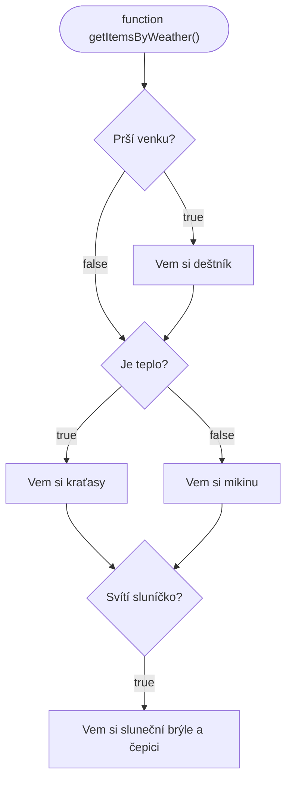

JavaScript je programovací jazyk, který dnes běží **prakticky všude**. Můžeme v něm psát webové, mobilní a desktopové aplikace a i aplikace, které běží na serveru.

>[!info]- Přesnější definice
>JavaScript:
>- je **interpretovaný** (nebo [JIT kompilovaný](https://developer.mozilla.org/en-US/docs/Glossary/Just_In_Time_Compilation)) programovací jazyk.
>- je **slabě typovaný** (loosly typed) - proměnné mohou za běhu měnit typ
>- **single threaded** - běží pouze na jednom jádře
>- **objektově orientovaný**, imperativní a zároveň i deklarativní
>  
 > Nejčastěji běží v **prohlížeči**, ale stejně funguje i na [serveru](https://nodejs.org/en). Dají se v něm psát i [mobilní](https://reactnative.dev/) a [desktopové](https://www.electronjs.org/) aplikace. 
> 
> Kromě názvu nemá s **Javou** nic společného.

Otevři **vývojářskou konzoli** v prohlížeči (F12) a klikni na záložku "console". **Zkopíruj** a **vlož** následující kód a stiskni enter.

Možná ti to nedovolí vkládat text, **bacha**. Přečti si tu chybovou hlášku, co to píše.

```javascript
const greet = () => {
	console.log("Ahoj, světe!");
}

greet();
// Výstup: Ahoj, světe!
```

Gratuluju, už jsi oficiálně **programátor\*ka**!
# Proměnné

Proměnná je **základ** programování, uchováváme v ní **data** a následně s nimi pracujeme. 

Hodnotu **vypíšeme** pomocí `console.log`

```javascript
const pageTitle = "JavaScript - Úvod";
console.log(pageTitle);
// Výstup: JavaScript - Úvod

let viewCount = 100;
viewCount = viewCount + 1;
console.log(viewCount);
// Výstup: 101
```

Proměnná se v JavaScriptu **deklaruje** pomocí **klíčových slov** `const` a `let`. V kódu nahoře **deklarujeme** dvě proměnné - název kurzu a počet shlédnutí.

| `const`                                   | `let`                                             |
| ----------------------------------------- | ------------------------------------------------- |
| Nikdy **nemůžeme** přiřadit novou hodnotu | Hodnotu **můžeme** změnit a můžeme přiřadit novou |
| Snažíme se použít **vždy**                | Snažíme se používat co **nejméně**                |
| Nikdy **nemůžeme** znovu deklarovat       | Nikdy **nemůžeme** znovu deklarovat               |
| Vždy drží **stejný** datový typ (logicky) | Datový typ se **může změnit**                     |
Vždy proměnnou nazvi anglicky tak, aby byl **z názvu jasný obsah**. Nic se nestane, ale líp se to čte.

```javascript
// ✅ Správně!
const accountBalance = 800;
const favouriteMovieLink = "https://www.csfd.cz/film/345767";

// ❌ Špatně!
const nevim = 12;
const variable = "2902736809/2010";
const háčkyČárkyToTakyUmíAlePůjdešDoPekla = 666;
```

**Gratuluju**, rozumíš prvnímu odbornému termínu - **deklarace proměnné**!

Do proměnných jdou ukládat různé typy dat - [[number|čísla]], [[string|stringy]], [[Date|datumy]]... Rozlišujeme mezi sebou [[1. JavaScript - Úvod/primitivní datové typy/index|primitivní]] a [[1. JavaScript - Úvod/komplexní datové typy/index|komplexní]] datové typy.

Kód, který využívá proměnnou, **musí následovat** až po její **deklaraci**. Počítač (interpreter) to čte stejně jako Ty - **odshora** a **zleva**.

> [!todo]- Proč to nefunguje?
> Spusť si následující kód:
> ```javascript
> console.log(personName);
> const personName = "František Palacký";
> ```
> 
>Víš, proč to nefunguje?

Jeden název proměnné **nemůžeme** použít dvakrát - musí být **unikátní** (později si vysvětlíme, že to není tak jednoduché).

> [!todo]- Proč to nefunguje?
> Spusť si následující kód:
> ```javascript
> const personAge = 68;
> const personAge = 82;
> ```
> Víš, proč to nefunguje?
> 
> Pozor, ani toto nebude fungovat:
> ```javascript
> let personShoeSize = 41;
> let personShoeSize = 42;
> ```
> 
> Ani `let` nemůžeme **založit** dvakrát se stejným názvem. Můžeme ale udělat toto:
> ```javascript
> let personShoeSize = 41;
> personShoeSize = 42;
> ```

> [!caution]- Co je to klíčové slovo `var`?
> Úplně jednoduše: **nepoužívat**!
> 
> Když budeš na internetu hledat JS kód (a nebo Ti ho bude generovat AI), určitě narazíš na klíčové slovo `var`. 
> 
> Pokud Tě zajímá důvod, najdeš ho v sekci [[JavaScript - Expert/index]] - **"variable hoisting"**.
> 
> Jak jsme si řekli, že nejdřív musíš proměnnou nadefinovat a pak až jí použít, tak to pro `var` **neplatí**. Není to výhoda, kód to dělá **nepřehledným** a způsobuje to **neočekáváné** chování.

## Vyzkoušej:
- [ ] Nadefinovat proměnnou, která obsahuje název tvého oblíbeného filmu.
- [ ] Nadefinovat proměnnou, která obsahuje počet lidí na planetě zemi.
	- [ ] Přičti jednoho člověka (`+`)
	- [ ] Odečti 100 lidí (`-`)
	- [ ] Vynásob počet lidí dvěma (`*`)
	- [ ] Zredukuj populaci na polovinu (`/`)

# Funkce
Když potřebuješ opakovat nějakou logiku **pořád dokola**, akorát s jiným vstupem, použiješ na to **funkce**.

```javascript
// Zápis pomocí klíčového slovíčka function
function getUserGreeting(name) {
	// Tělo funkce - zde můžeš dělat třeba výpočet
	const greeting = `Zdarec, ${name}! 👋`;
	// Návratová hodnota funkce
	return greeting;
}

console.log(getUserGreeting("Hynku"));
// Výstup: Zdarec, Hynku! 👋
console.log(getUserGreeting("Viléme"));
// Výstup: Zdarec, Viléme! 👋
console.log(getUserGreeting("Jarmilo"));
// Výstup: Zdarec, Jarmilo! 👋

// Zápis pomocí "arrow function"
const getUserWelcomeMessage = (name) => {
	return `Vítej, ${name} 😁 Moc rád jsem že tu seš.`;
}

console.log(getUserWelcomeMessage("Lído"));
// Výstup: Vítej, Lído 😁 Moc rád jsem že tu seš.
console.log(getUserWelcomeMessage("Tomáši"));
// Výstup: Vítej, Tomáši 😁 Moc rád jsem že tu seš.
console.log(getUserWelcomeMessage("Štěpáne"));
// Výstup: Vítej, Štěpáne 😁 Moc rád jsem že tu seš.
```

| **Název funkce**          | `getUserGreeting` |
| ------------------------- | ----------------- |
| **Parametr funkce a typ** | `name` - `string` |
| **Typ návratové hodnoty** | `string`          |

> [!tip] Buď konzistentní
> Vidíš, že funkce jde zapsat **dvěma různými způsoby**. 
> 
> Je mezi nimi rozdíl, ale pro začátek Tě vůbec **nemusí zajímat**.[^1] Buď konzistentní, zkus ty zápisy nemíchat.

**Parametrů** funkce můžeš mít kolik chceš a můžou mít úplně jakýkoli datový typ - číslo, string, další funkce, objekt, array...

**Tělo funkce** může dělat ve svém [scope](https://developer.mozilla.org/en-US/docs/Glossary/Scope)[^4] úplně cokoli - počítat, načítat data, zapisovat data...

Funkce může **vracet** (returnovat) úplně cokoli - číslo, [[object|objekt]], [[Rozdíl mezi null, undefined a nullish|null]], [[Rozdíl mezi null, undefined a nullish|undefined]]...
## Příklad použití funkcí

Zjednodušený výpočet úroku na ročním termínovaném vkladu[^2]:
```javascript
// Neřešíme nepřesnost desetinných čísel, neděláme core systém banky 💰
const CAPITAL_INCOME_TAX_RATE = 0.15; // 15 %

const getYearlyInterest = (startBalance, yearlyInterestRate) => {
	const interest = startBalance * yearlyInterestRate;
	return interest;
}

const getTaxAmount = (amount, taxRate) => {
	const tax = amount * taxRate;
	return tax;
}

const getTermDepositValues = (depositAmount, yearlyInterestRate, taxRate = CAPITAL_INCOME_TAX_RATE) => {
	const interestBeforeTax = getYearlyInterest(depositAmount, yearlyInterestRate);
	const interestTax = getTaxAmount(interestBeforeTax, taxRate);
	
	const interestAfterTax = interestBeforeTax - interestTax;
	// Hodnoty po jednom roce úročení
	const finalAmountAfterTax = depositAmount + interestAfterTax;
	
	return {
		depositAmount,
		interestBeforeTax,
		interestTax,
		interestAfterTax,
		finalAmountAfterTax
	};
}

const values = getTermDepositValues(10_000, 0.031);

console.log("Vložená částka: ", values.depositAmount);
// Výstup: Vložená částka:  10000
console.log("Úrok po jednom roce před daní: ", values.interestBeforeTax);
// Výstup: Úrok po jednom roce před daní:  310
console.log("Daň z úroku: ", values.interestTax);
// Výstup: Daň z úroku:  46.5
console.log("Úrok po zdanění: ", values.interestAfterTax);
// Výstup: Úrok po zdanění:  263.5
console.log("Celkem máš po 1 roce: ", values.finalAmountAfterTax);
// Výstup: Celkem máš po 1 roce:  10263.5
```

Na příkladu je použitej i [default parameter](https://developer.mozilla.org/en-US/docs/Web/JavaScript/Reference/Functions/Default_parameters) `taxRate` - použije se výchozí hodnota, pokud ho nevyplníš.

## Pravidla čisté funkce

- Funkce dělá **jednu věc** a tu dělá dobře (je atomická)
- Funkce funguje **samostatně** (nemá sideffecty)
	- Pracuje jenom parametry, ne s hodnotami "okolo"[^3]
	- Vrací hodnoty, nesahá na hodnoty "okolo"
- Má konzistentní výstup - vrací vždy stejný datový typ
- Když má více vstupních/výstupních parametrů, používej [[object|objekty]]

Když máš čistou funkci, můžeš k ní napsat **testy** a můžeš jí věřit. Na začátku určitě budeš mít funkce špinavý, ale neboj, to **budeme ladit**. Vždycky Ti poradím.

### Vyzkoušej

Udělej funkci, která:
- [ ] spočítá počet lidí na planetě Zemi po redukci populace na polovinu (lusknutí Rukavicí nekonečna)
- [ ] spočítá týdenní počet prodaných smažáků v jídelně
	- [ ] ve škole je 500 studentů a denně si ho koupí 10 % z nich
- [ ] spočítá počet gramů cukru v nápoji při zadání množství (ml) a množství (g) cukru na 100 mililitrů
	- [ ] 355ml plechovka RedBullu má 11 g cukru na 100 ml
	- [ ] 100ml sklenice vody má 0 g cukru na 100 ml
	- [ ] 1l lahev pomerančového džusu má 9.1 g cukru na 100 ml

# Podmínky
Můžeme se v kódu **rozhodovat**, co se má stát, pokud nastala nějaká **podmínka**.

Stačí nám dvě **klíčová slovíčka** - `if` a `else`. Buď to, nebo to.

```javascript
const isRaining = true;

// Pokud je proměnná isRaining true, spustí se následující kód
if (isRaining) {
	// Například ti připomene v 7:00, že si máš vzít deštník.
	console.log("Prší 🌧");
}
// Pokud je proměnná isRaining false, vykoná se následující kód
else {
	console.log("Neprší 😁");
}
```

Kód v `if` bloku se vykoná vždy, když je hodnota `true`. Na vysvětlení vyhodnocení podmínek slouží celá kapitola [[boolean]].

```javascript
const age = 17;

if (age < 18) {
	console.log("Zákaz prodeje alkoholických nápojů, tabákových výrobků, kuřáckých pomůcek, elektronických cigaret, nikotinových sáčků bez obsahu tabáku a bylinných výrobků určených ke kouření osobám mladším 18 let");
}
```

Ukážeme si složitější situaci na následujícím **diagramu**:



Ten bychom v JavaScriptu zapsali takto:

```javascript
function getItemsByWeather(isRaining, isWarmWeather, isSunny) {
	if (isRaining) {
		console.log("Vem si deštník");
	}
	
	if (isWarmWeather) {
		console.log("Vem si kraťasy");
	}
	else {
		console.log("Vem si mikinu");
	}
	
	if (isSunny) {
		console.log("Vem si slunčení brýle a čepici");
	}
}

getItemsByWeather(false, true, true); // Spusť si to a schválně, co to vypíše.
```


[^1]: Je to něco, co by si potom reálně měl\*a znát, můžou se Tě na to ptát třeba při pohovoru. Najdeš to v kapitole [[Function vs Arrow function]].

[^2]: Peníze v bance takhle nemůžeš počítat kvůli [[number#Nutné vědět|nepřesnosti desetinných čísel]]. Ale jako jednoduchá kalkulačka na webu je to good enough. Jak to dělat správně se řeší v úloze [[3. Banka]].

[^3]: Můžeš vytvářet i [closures](https://developer.mozilla.org/en-US/docs/Web/JavaScript/Guide/Closures), ale musíš vědět, co děláš.

[^4]: TODO: Napsat na to separátní kapitolu.
