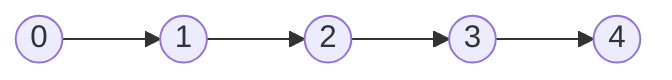
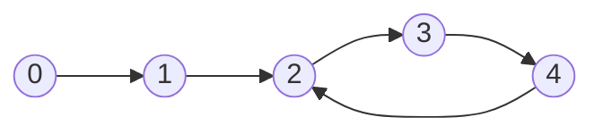

Na vstupu je **linked list** (spojový seznam). Tvým úkolem je zjistit, zda se v něm nachází **cyklus** (některý z nodů míří na předchozí node).

Linked list **bez cyklu**


Linked list **s cyklem**


Detaily:
- Pokud obsahuje **pouze jeden prvek**, není v něm cyklus
- Pokud neobsahuje **žádný prvek**, není v něm cyklus
  
```typescript
class ListNode {
    val: number
    next: ListNode | null
    constructor(val?: number, next?: ListNode | null) {
        this.val = (val === undefined ? 0 : val)
        this.next = (next === undefined ? null : next)
    }
}

function hasCycle(head: ListNode | null): boolean {
    // Doplň tělo funkce
};
```

> [!abstract] Testy - správného chování
> ```typescript
> describe("Is linked list circular", () => {
>     test("Without cycle", () => {
>         const node1 = new ListNode(2);
>         const node2 = new ListNode(2, node1);
>         const node3 = new ListNode(3, node2);
>         const node4 = new ListNode(4, node3);
>         const head = new ListNode(5, node4);
> 
>         expect(hasCycle(head)).toStrictEqual(false);
>     });
> 
>     test("With a cycle back to start", () => {
>         const node1 = new ListNode(2);
>         const node2 = new ListNode(2, node1);
>         const node3 = new ListNode(3, node2);
>         const node4 = new ListNode(4, node3);
>         const head = new ListNode(5, node4);
> 
>         // Cycle
>         node1.next = head;
> 
>         expect(hasCycle(head)).toStrictEqual(true);
>     });
> });
> ```

Pokud nevíš, jak na **optimální řešení**, tak to zkus vyřešit **jakýmkoli způsobem**. Potom si přečti, jak funguje optimální algoritmus a zkus ho naprogramovat.

> [!question]- Nápověda - naivní algoritmus
> Tento algoritmus není **optimální** (má vysokou **paměťovou náročnost**), ale je funkční.
> 
> Procházej linked list a ke každému nodu si ulož, zda už **byl navštíven**.
> 
> Když narazíš na už **navštívený node**, má cyklus.
> 
> Když **dojdeš na konec** (další node je `null`), nemá cyklus.

> [!question]- Řešení - naivní algoritmus
> ```typescript
> // Naive solution - high memory footprint
> export const hasCycle = (head: ListNode | null): boolean => {
>     const set = new Set<ListNode\>();
>     let currentNode: ListNode | null = head;
> 
>     while (currentNode) {
>         if (set.has(currentNode)) return true;
> 
>         set.add(currentNode);
>         currentNode = currentNode?.next;
>     }
> 
>     return false;
> };
> ```

> [!tip]- Nápověda - optimální algoritmus
> Algoritmus se jmenuje "Floyd's tortoise 🐢 and hare 🐇 algorithm"
> 
> Máš **dva pointery**. Jeden pomalej 🐢 a druhej rychlej 🐇
> 
> Pomalej pointer 🐢 začne na **začátku** spojového seznamu.
> Rychlej pointer 🐇 začne na **začátku + 1** spojového seznamu.
> 
> Pomalej pointer 🐢 vždy **postupuje o jeden** node.
> Rychlej pointer 🐇 vždy **postupuje o dva** nody.
> 
> Pokud se někdy tyto pointery **potkají** (rovnají se), list **má cyklus**.
> 
> Pokud rychlej pointer 🐇 **narazí na konec** listu, **nemá cyklus**.
> 
> Proč to funguje? 🤔
> 
> Pokud je v listu cyklus, rychlej pointer 🐇 předběhne a eventuelně doběhne ten pomalej 🐢 a budou se rovnat.
> 
> TODO: Udělat/najít nějakou hezkou vizualizaci

> [!tip]- Řešení - optimální algoritmus
> ```typescript
> // Floyd's tortoise and hare algorithm
> export const hasCycle = (head: ListNode | null): boolean => {
>     let slowPointer = head;
>     let fastPointer = head?.next;
> 
>     while (fastPointer && slowPointer) {
>         slowPointer = slowPointer?.next;
>         fastPointer = fastPointer?.next?.next;
> 
>         if (slowPointer === fastPointer) return true;
>     }
> 
>     return false;
> };
> ```